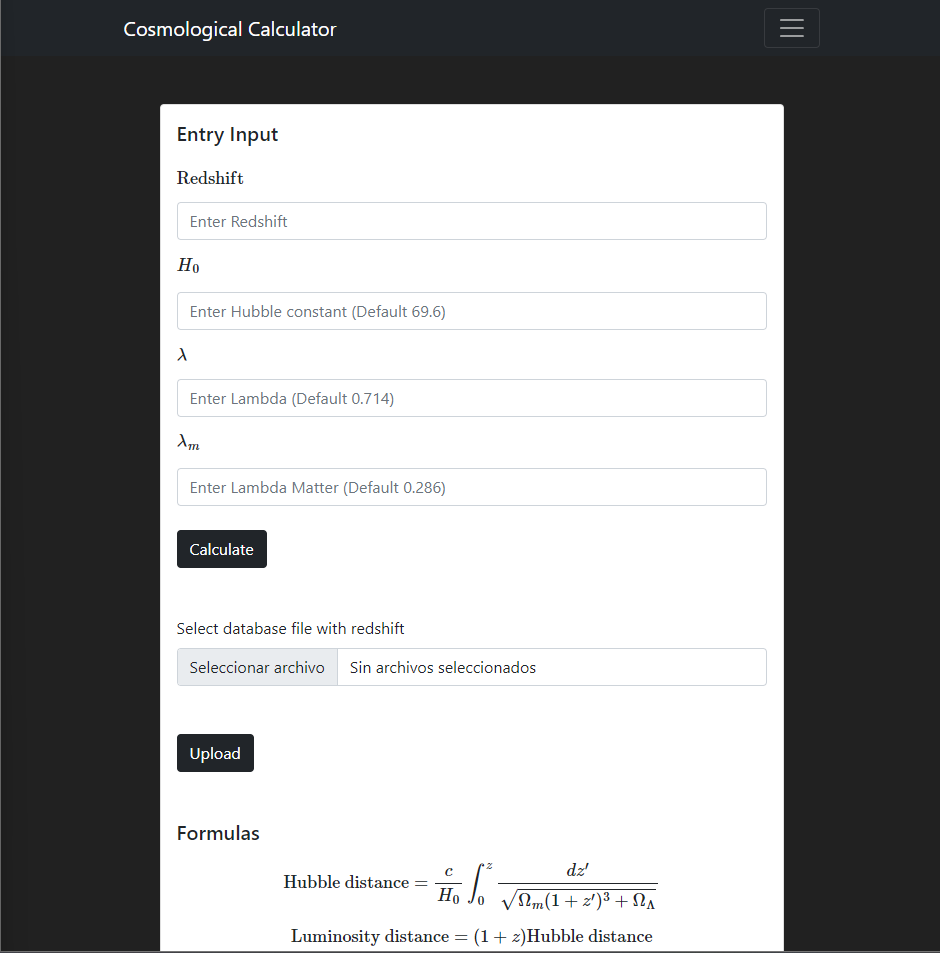

# Cosmological Calculator

## Libraries

```
python -m pip install django numpy 
```

## Usage

To run the calculator you need to run the `mangage.py` file

```bash
python manage.py
```

In your browser you need to open the following url: [http://127.0.0.1:8000/]()



Processed databases will saved in the current working directory as `result -...-.csv`
